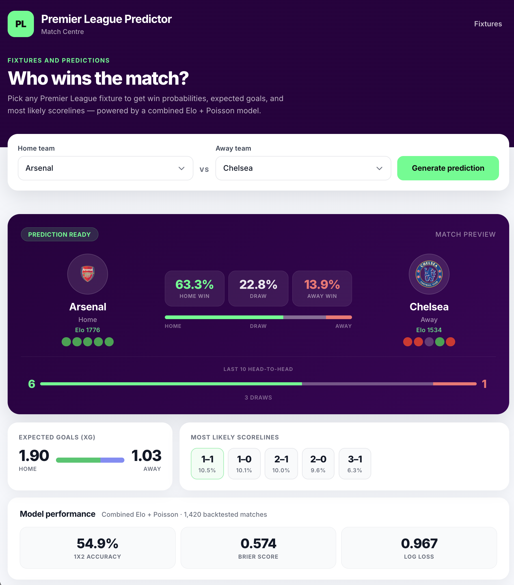
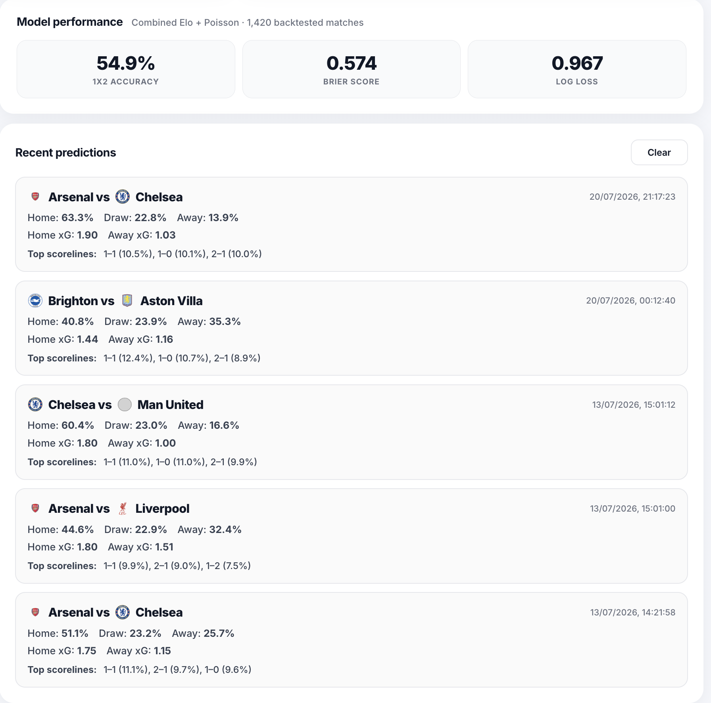

# Premier League Predictor

A football analytics application that forecasts Premier League match outcomes using a combined Elo rating system and Poisson goals model, served through a FastAPI backend with a live prediction UI.

**Live demo: [epl-predictor-xmqs.onrender.com](https://epl-predictor-xmqs.onrender.com)**

---

## Screenshot




---

## How It Works

Predicting football is hard. A 55% accurate model is genuinely competitive with betting market baselines. This project approaches the problem in two complementary ways and combines them.

**Elo ratings** track each team's relative strength across time. After every match, ratings shift based on the result and the gap between the two teams' expected and actual performance. A team beating a stronger side gains more than a team beating a weaker one. At prediction time, the rating difference produces a win probability.

**Poisson goals model** treats the number of goals a team scores as a Poisson-distributed random variable. Two separate regressors — one for home goals, one for away goals — are trained on historical match data. Features include team identity (one-hot encoded) and a rolling attack/defence form metric derived from each team's last five matches. From the predicted expected goals (xG), the full score matrix is computed: every scoreline from 0–0 to 6–6 gets an individual probability, which are then summed into home win, draw, and away win outcomes.

**Combined model** blends 70% Elo and 30% Poisson probabilities. Elo dominates because it captures long-run team quality more stably; Poisson adds scoreline-level granularity and recent form signal.

---

## Model Performance

All metrics are from a **walk-forward backtest** — the model is trained on matches before each prediction and tested on the next match it has never seen. This mirrors real-world use and avoids any data leakage.

| Model | Matches | Accuracy | Brier Score | Log Loss |
|---|---|---|---|---|
| Elo only | 1,520 | 54.1% | 0.581 | 0.978 |
| Poisson only | 1,420 | 52.7% | 0.596 | 1.008 |
| **Combined (production)** | **1,420** | **54.9%** | **0.574** | **0.967** |

**Baselines for context:**
- Random guess (uniform 33/33/33): ~33% accuracy, Brier ~0.667
- Always predicting home win: ~45% accuracy
- Betting market closing odds: ~54–56% accuracy

The combined model sits at betting-market level, which is the realistic ceiling for a model trained on scoreline history alone without squad, injury, or xG data.

---

## Tech Stack

- **Python 3.11** — data pipeline, models, API
- **FastAPI + Uvicorn** — prediction API and static file serving
- **scikit-learn** — Poisson regression with one-hot + form feature pipeline
- **pandas / pyarrow** — data processing and parquet storage
- **pytest** — API and model unit tests
- **Vanilla JS / HTML / CSS** — frontend (no framework dependency)

---

## Project Structure

```
epl_predictor/
├── src/
│   ├── main.py                  # FastAPI app entry point
│   ├── api/
│   │   ├── routes.py            # All prediction and fixtures endpoints
│   │   └── schemas.py           # Pydantic response models
│   ├── models/
│   │   ├── elo.py               # Elo rating math (pure functions)
│   │   └── poisson.py           # Poisson model + rolling form features
│   ├── data/
│   │   └── updater.py           # Auto-fetch season CSVs and rebuild parquet
│   ├── data_pipeline/
│   │   ├── load_raw.py          # Merge raw season CSVs
│   │   ├── clean_matches.py     # Clean and validate match data
│   │   └── build_features.py    # Output matches.parquet
│   └── evaluation/
│       ├── metrics.py           # Accuracy, Brier score, log loss
│       ├── backtest.py          # Elo walk-forward backtest
│       ├── backtest_poisson.py  # Poisson walk-forward backtest
│       └── backtest_combined.py # Combined model walk-forward backtest
├── data/
│   ├── raw/                     # Season CSVs (EPL 2021–2026)
│   └── processed/               # Parquet files and backtest summaries
├── frontend/
│   ├── index.html               # Prediction UI
│   ├── fixtures.html            # Upcoming fixtures + inline predictions
│   ├── app.js                   # Predictor page logic
│   ├── fixtures.js              # Fixtures page logic
│   ├── styles.css               # Shared styles
│   ├── fixtures.css             # Fixtures page styles
│   └── badges/                  # Team badge images
├── scripts/
│   ├── fetch_latest_results.py  # CLI to refresh current season data
│   ├── combine_raw_seasons.py   # Merge raw data
│   ├── build_team_strengths.py  # Build team strength JSON
│   └── build_fixtures_json.py   # Extract upcoming fixtures
├── tests/
│   ├── test_elo.py              # Elo model unit tests
│   └── test_routes.py           # API route integration tests
└── requirements.txt
```

---

## Running Locally

**1. Clone and create a virtual environment**

```bash
git clone <repo-url>
cd epl_predictor
python -m venv .venv
source .venv/bin/activate
pip install -r requirements.txt
```

**2. Build the processed data**

```bash
python -m src.data_pipeline.load_raw
python -m src.data_pipeline.clean_matches
python -m src.data_pipeline.build_features
```

**3. Run the backtests** (optional — pre-built summaries are included)

```bash
python -m src.evaluation.backtest
python -m src.evaluation.backtest_poisson
python -m src.evaluation.backtest_combined
```

**4. Start the server**

```bash
uvicorn src.main:app --reload
```

Open [http://localhost:8000](http://localhost:8000) in your browser.

**5. Run tests**

```bash
pytest tests/ -v
```

---

## API Reference

| Endpoint | Method | Description |
|---|---|---|
| `/health` | GET | Health check |
| `/teams` | GET | List all teams in the dataset |
| `/predict?home=X&away=Y` | GET | Combined Elo + Poisson prediction |
| `/predict/score?home=X&away=Y` | GET | Poisson-only xG and scoreline probabilities |
| `/fixtures` | GET | Upcoming fixtures for the current season |
| `/form?team=X&n=5` | GET | Last N results for a team (W/D/L) |
| `/h2h?home=X&away=Y&n=10` | GET | Head-to-head record between two teams |
| `/backtest/summary` | GET | Model evaluation metrics |
| `/refresh` | POST | Re-fetch latest season data and rebuild model (token-protected) |

**Example — predict Arsenal vs Chelsea:**

```bash
curl "https://epl-predictor-xmqs.onrender.com/predict?home=Arsenal&away=Chelsea"
```

```json
{
  "home": "Arsenal",
  "away": "Chelsea",
  "p_home": 0.511,
  "p_draw": 0.238,
  "p_away": 0.251,
  "r_home": 1587.4,
  "r_away": 1521.2,
  "xg_home": 1.75,
  "xg_away": 1.31,
  "top_scorelines": [
    { "home_goals": 1, "away_goals": 1, "prob": 0.112 },
    { "home_goals": 2, "away_goals": 1, "prob": 0.097 },
    { "home_goals": 1, "away_goals": 0, "prob": 0.091 }
  ]
}
```

---

## Data

Match data sourced from [football-data.co.uk](https://www.football-data.co.uk/englandm.php), covering five Premier League seasons (2021/22 – 2025/26). Each row is one completed match with final score and result.

The server auto-refreshes training data on startup if the dataset is more than 7 days old, and a weekly cron job keeps it current throughout the season.

---

## Development Log

### Initial build

The idea was simple — I wanted to be able to predict Premier League results using actual data rather than just vibes. I started with Elo ratings because they're clean and interpretable: every team starts at 1500, and ratings shift after each match based on what was expected vs what happened. That alone gave decent accuracy. The Poisson model came next to add scoreline-level detail — instead of just win/draw/loss, you get expected goals and a full probability distribution over every scoreline. I combined them 70/30 in favour of Elo because Elo is more stable over a season and Poisson adds the texture on top.

The backtest was done walk-forward — the model never sees future matches when making a prediction, which is how it would actually work in real life. 54.9% accuracy across 1,420 matches, which sits right at betting market level. That's roughly the ceiling you can reach with historical scoreline data alone.

Once the model was working I built a FastAPI backend to serve predictions and a basic frontend to interact with it. Got it deployed on Render and left it there for a while.

---

### July 2026 — Fixtures page, bug fixes, and performance

This was probably the biggest single session of work on the project. I wanted to take it from a standalone predictor to something that actually shows the upcoming 2026-27 Premier League fixtures with predictions already attached to each game. Here's how that went.

**Fixtures page**

The first thing was getting fixture data. I registered for a free API key at [football-data.org](https://www.football-data.org) which gives you access to the full schedule. Built a `/fixtures` endpoint on the backend that fetches the 2026-27 schedule, and a new Fixtures page on the frontend that groups games by matchweek and loads inline predictions for each fixture in parallel. You can page through every matchweek and see home win %, draw %, away win %, xG, and the top expected scoreline for each game.

**Team name mapping nightmare**

The first real issue was that predictions were showing as unavailable for a bunch of teams. Turns out the football-data.org API returns short names like `Man United`, `Nottingham`, `Brighton Hove` — but the training data from football-data.co.uk uses a completely different set of names like `Man United`, `Nott'm Forest`, `Brighton`. I had a mapping dictionary that was supposed to bridge them, but it was mapping to long-form names like `Manchester United` and `Newcastle United` that don't exist anywhere in the model. Every prediction for those teams was hitting a 400 error. Fixed it by going through every API shortName and making sure it maps to the exact string that's in the parquet.

**The Arsenal badge bug**

Every team that didn't have a badge was showing the Arsenal crest. Took a second to figure out why — turns out `placeholder.png` was literally a copy of `arsenal.png`, same file, same 74KB. So any unknown team fell back to the placeholder, which just showed Arsenal. Replaced it with a neutral grey circle.

**Promoted teams**

Coventry City and Hull City are newly promoted and have never played in the Premier League in our dataset window, so they had no Elo rating and no Poisson parameters. The backend was rejecting them entirely with a 400 error. Fixed this by removing the strict team validation from the predict endpoint — the Elo model defaults to 1500 (league average) for unknown teams, and the Poisson model already has `handle_unknown="ignore"` on its encoder which falls back to league-average rates. They get a reasonable prediction now, just less precise than an established club.

Also grabbed proper crests for Sunderland, Hull City, and Coventry City directly from the football-data.org API and added them to the badge directory.

**Performance**

The site was painfully slow. A few things contributed:

- Badge images were enormous. Manchester United's badge was 2.3MB, Chelsea's was 1.2MB, Aston Villa was 711KB. Total badge weight across all clubs was over 8MB. Compressed everything down to 120×120px — total dropped to 479KB, a 15× reduction.
- The model was being loaded lazily on the first prediction request, which meant the first person to use the site after a cold start was waiting for the parquet to load, Elo ratings to compute, and the Poisson model to fit. Moved that to server startup so it's ready before any requests come in.
- Every prediction was being recomputed from scratch. Added an in-memory cache so each home/away pair is computed once and reused. The fixtures page loads 10 predictions at once — on a warm cache they're near-instant.
- The team dropdowns were waiting for a `/teams` API response on page load. Fixed by injecting the teams list directly into the HTML when the server renders the page, so the dropdowns populate immediately with no extra round trip.
- Added GZip middleware for API responses and JS/CSS.

**Auto-updating data**

The training data only covers up to the last match in the parquet, so as the 2026-27 season plays out the model would get stale. Set up three layers: the server checks data age on startup and triggers a background refresh if it's more than 7 days old, there's a token-protected `/refresh` endpoint you can call manually, and a weekly Render cron job runs every Monday morning to pull the latest results from football-data.co.uk and rebuild the parquet automatically.

---

## Potential Extensions

- Bookmaker odds comparison and value bet identification
- xG-based Poisson model (replace goals with shot quality data)
- Squad-level features (injuries, suspensions)
- Interactive model comparison dashboard
